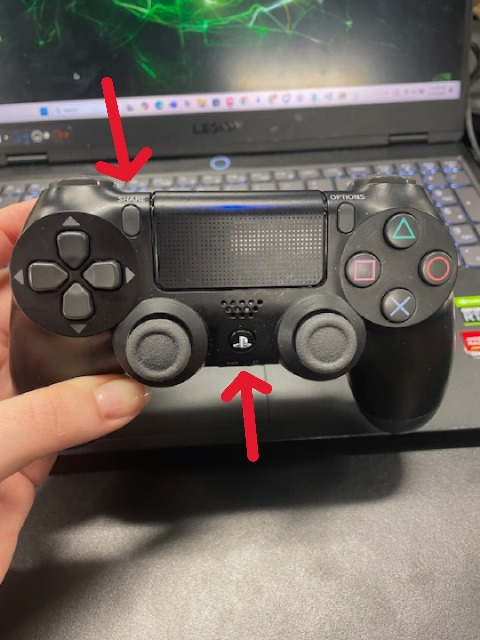

# WorkDay: RBT on Physical Vehicle

## Connecting to the F1 Vehicle
Student groups must download [NoMachine](https://www.nomachine.com/) 
to a dedicated laptop. Only one user may connect to the vehicle at a time (*NoMachine will kick the previous user if you try to remote desktop with multiple users.*)

### Finding the Vehicle's IP 
In a terminal, ssh into the vehicle using ```ssh YOUR_GROUP_NAME@YOUR_CAR_NUMBER```. Input the credentials 
specific to your vehicle and group name.

<!--Private repo for groups share the credentials -->

Students must be connected to their specific router to ssh into their vehicle. If you cannot ssh, check your wifi connection and make sure eduroam is not hijacking your connection. You will get the following output to your terminal if you have successfully connected:

```bash
PS C:\Users\MyPC> ssh f1@rc0
f1@rc0's password:
Welcome to Ubuntu 20.04.6 LTS (GNU/Linux 5.10.120-tegra aarch64)

>>> SNIP <<<

f1@rc0:~$
```

Run the following command and look for wlan0's inet numbers. In the example below, the number is **192.168.1.4**.

<!--Should check if we can make ip static-->
```bash
f1@rc0:~$ ifconfig

>>> SNIP <<<

wlan0: flags=4163<UP,BROADCAST,RUNNING,MULTICAST>  mtu 1500
        inet 192.168.1.4  netmask 255.255.255.0  broadcast 
        192.168.1.255

>>> SNIP <<<

f1@rc0:~$
```
### Remote Desktop onto the Vehicle
Open NoMachine and hit the **Add** connection button on the top left of the UI.


Create a name for your connection (it can be anything) and input the IP into the **HOST** section. Students do not need to make changes to the Port or Protocol.


*Note: The IP address may change arbitrarily between connections. You need 
to find and update the IP for your vehicle. You can edit a connection by right-clicking on it and selecting **Edit Connection**.*

Use your credentials when prompted to Log-In and then Log-In again when the User's List appears.

Upon a successful connection, you will see the following:


### Connect the PS4 controller

Students must hold down the **PS button** and the **SHARE** button at the same time until they see a flashing white light from the LED. 

*Note: You **MUST** log-in to your user before you can connect the PS4 controller.*



The LED lights on the controller will light up different colors, dependent on the vehicle they are connected to. They are as follows:

- rc0: Blue
- rc1: Red
- rc2: Green

An example of a Blue lit LED connection to rc0 is shown below.


### Launch the F1Tenth Stack 

Next, you will start all required nodes to drive the vehicle manually. 

Run the following commands in the terminal:
```bash
source /opt/ros/foxy/setup.bash
source f.1ws/install/setup.bash
ros2 launch f1tenth_stack bringup_launch.py
```

Example output is pictured below:


### Drive!

Finally, there exists a "dead man's switch" to allow your controller to post drive commands to the vehicle. In case the car gets out of control, releasing the switch will stop the car. This switch is assinged to **LB**/**L1**- hold it down to be able to drive.

The left joystick is used for throttle, the right joystick is used for steering.


### RViz2

Run the following command to launch rviz:
```bash
f1@rc0:~$ rviz2
```

## Troubleshooting

### VESC
If your VESC is flashing a red light, your battery does not have enough power and must be charged. The VESC will die first, then your no machine connection. It is always the safest bet to assume the battery is dead so we don't kill any more.
<!--## RBT on Vehicle

-->